El código de esta fase está en las secciones 1 a 5 del <a href="https://github.com/Ciz26/proyecto-depresion-tdsp/blob/main/Code/Modeling/modelo_regresion_logistica_depresion.ipynb">cuaderno</a>. Se conserva en un solo archivo porque las secciones de modelado usan los objetos que se crean aquí.

