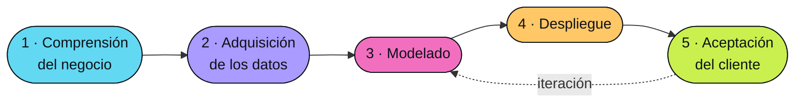

```mermaid
flowchart LR
  A(["1 · Comprensión<br>del negocio"]) --> B(["2 · Adquisición<br>de los datos"]) --> C(["3 · Modelado"]) --> D(["4 · Despliegue"]) --> E(["5 · Aceptación<br>del cliente"])
  E -. iteración .-> C
  style A fill:#63D8F2,stroke:#0d1117,color:#0d1117
  style B fill:#A99BFF,stroke:#0d1117,color:#0d1117
  style C fill:#F26FC0,stroke:#0d1117,color:#0d1117
  style D fill:#FFC766,stroke:#0d1117,color:#0d1117
  style E fill:#C9F04E,stroke:#0d1117,color:#0d1117
```

